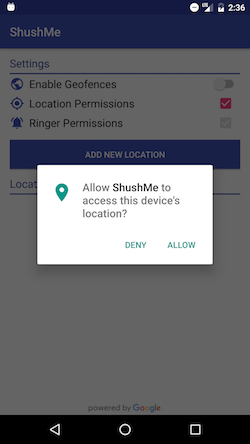

# ShushMe
Google Places API demo app

To use this app, get a Google Maps API from here: https://console.developers.google.com/flows/enableapi?apiid=placesandroid&reusekey=true, then put yout key in the meta-data in your AndroidManifest.xml file.

## Screenshots

  
  
